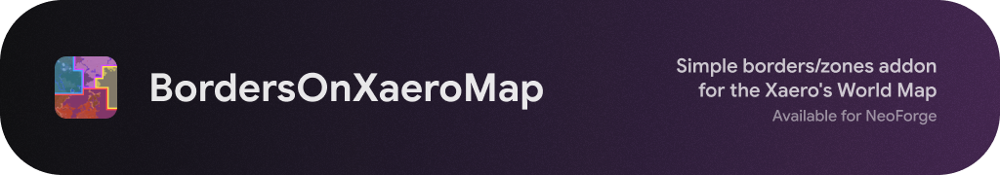

Simple borders/zones addon for the Xaero's World Map

---

Open source, designed for simple use on small/medium multiplayer servers and available for NeoForge 1.21.1 (you can expect other 1.21.x versions and mod loaders to be supported)

> [!NOTE]
> The mod is in the rapid development state and currently it doesn't support multiplayer (it's safe to use on servers, but it's local only).\
> There'll be no support for other MC versions and mod loaders until the mod is finished for 1.21.1 NeoForge.

> [!NOTE]
> This codebase has a lot of AI-generated code (GPT 5.2 Codex xHigh).

## License
Except where otherwise stated, the content of this repository is provided under the [GNU GPLv3 license](./LICENSE).

---

Not associated with or approved by Mojang or Microsoft.